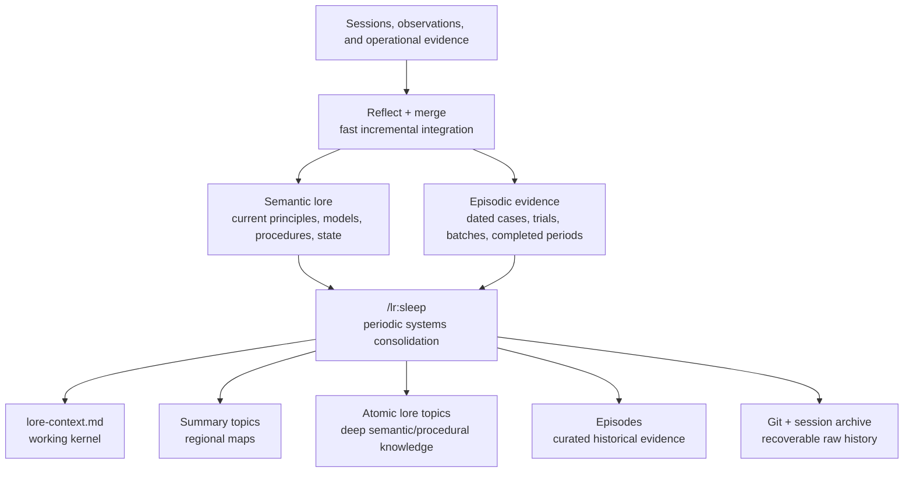

# Lore Sleep — Periodic Knowledge Consolidation

> **Historical exploration — not an active design.** Retained in the lore-architect workdir for
> rationale and discarded alternatives from the original “sleep” framing. It does not define a
> framework command or implementation.
>
> **Status at the time:** design exploration, not an executable procedure yet.
>
> **Original proposed product surface:** `/lr:sleep` (not adopted)
>
> **Recommended first ship:** genuinely read-only report to stdout. No pull, saved report,
> lore rewrite, move, deletion, commit, or push unless the user selects a separate explicit mode.

## Decision in one paragraph

Lore needs a second curation timescale. Per-session reflect/merge should remain fast,
incremental, and preservation-biased. A separate periodic **sleep** process should examine one
agent's complete active lore system, replay recent and representative older knowledge, detect
interference and structural drift, extract stable generalizations, strengthen summary hubs,
reduce redundant active memory, and test whether the resulting structure improves future task
performance. It should be a hybrid process: deterministic corpus analysis for mechanical facts,
agent judgment for meaning, one writer for any future apply mode, and an independent verifier.
Age is evidence, never a deletion rule.

## Why this is now a real need

The framework currently has an encoding force but only a weak subtraction force:

- Reflection extracts session learning.
- Merge integrates it conservatively into existing lore.
- `lore-context.md` is maintained incrementally.
- Git preserves every past version.
- Nothing periodically asks whether the accumulated representation is still the best one.

The existing lore-architect backlog already identifies the resulting drift: context files grow
toward indexes, sibling topics over-granulate, summary hubs weaken, obsolete claims remain
retrievable, and references rot. The current corpus confirms that this is no longer hypothetical.

### Corpus snapshot, 2026-07-25

Across the current substantive agents:

- **287 lore topics**, roughly **1.19 MB** of Markdown.
- Lore Architect alone: **172 topics**, roughly **112K words**, with `lore-context.md`
  referencing about **115** topics.
- Health Advisor: **50 topics**, with `lore-context.md` referencing about **42** topics and
  carrying durable health constraints, current measurements, recent chronology, procedures, and
  unresolved tasks in one every-session file.
- MassChallenge Judge: **17 topics**, 12 of them batch histories; its context simultaneously
  records batch 12 as complete and retains a stale sentence saying one batch-12 application was
  still being scored.
- DLT Advisor retains an expired operational deadline in active context.
- RC Glider Designer contains a direct attribution conflict across two current topics.
- Link conventions differ across agents: some use `[[wiki-links]]`, some use filenames or paths.

The corpus exhibits four different memory functions under one undifferentiated `lore/` directory:

1. Durable schemas, principles, and procedures.
2. Mutable current state.
3. Dated episodes and evidence.
4. Authoritative records or pointers to an external source of truth.

The current corpus is also too young to justify a universal age threshold: most committed topics
were touched within the last few months, and mechanical migrations can make old knowledge look
new. This is direct evidence against "archive anything untouched for N days."

## The core model: two learning systems, several retrieval depths

The most useful part of the sleep analogy is not inactivity. It is **systems consolidation**:
rapidly captured episodes are selectively replayed and integrated into slower, structured
knowledge. Cognitive research describes sleep as preserving episodic traces while transforming
repeatedly reactivated material toward decontextualized, schema-like representations
([Rasch & Born, 2013](https://doi.org/10.1146/annurev-neuro-062012-170429)). Complementary
Learning Systems theory likewise separates fast storage of specific experiences from slower
acquisition of structured knowledge, with replay interleaving the two
([Kumaran, Hassabis & McClelland, 2016](https://doi.org/10.1016/j.tics.2016.05.004)).

Lore should use the analogy as a design guide, not imitate neuroscience literally.



### Recommended memory depths

| Depth | Function | Current/proposed representation | Normal retrieval |
|---|---|---|---|
| Working kernel | Knowledge needed in nearly every session | `lore-context.md` | Always loaded |
| Regional maps | High-level schemas and routes into a knowledge area | Summary topics in `lore/` | Followed from context or found by recall |
| Semantic memory | Current principles, models, procedures, and compact state pointers | Atomic topics in `lore/` | Default lore search |
| Episodic memory | Dated evidence: trials, cases, batches, completed periods | Optional future `episodes/` | Searched for history, evidence, temporal reasoning, or when linked from lore |
| Authoritative state | Mutable records whose exact current value lives outside prose | Ledgers, source docs, APIs, or other declared sources in `workdir/`/sibling repos | Read through the owning agent's procedure when current state is needed |
| Raw history | Full prior states and session evidence | Git history, `sessions/`, `archive/` | Explicit forensic search only |

The hierarchy should not become a rigid directory taxonomy inside `lore/`. Summary topics already
provide regions, and one topic can legitimately belong to several regions. The physical split
worth evaluating is only the semantic/episodic boundary; the other depths already exist.

### What adjacent agent-memory systems contribute

Several established approaches illuminate one part of the problem without solving Lore's full
curation problem:

- **Generative Agents** keeps an experience stream and periodically synthesizes higher-level
  reflections; its evaluation found observation, planning, and reflection all contributed to
  behavior ([Park et al., 2023](https://arxiv.org/abs/2304.03442)). This supports promotion from
  episodes to abstractions, but does not provide a periodic whole-corpus garbage collector.
- **MemGPT** treats context as virtual memory and moves information between fast and slow tiers
  ([Packer et al., 2023](https://arxiv.org/abs/2310.08560)). This supports differentiated access
  depths, but tier movement alone does not detect contradictions or improve the knowledge model.
- **RAPTOR and GraphRAG** support retrieval across leaf detail and higher-level summaries. They
  motivate stronger regional hubs, but their generated hierarchies are derived retrieval
  structures; Lore Sleep must curate the canonical Markdown itself.
- **LongMemEval** shows that extraction alone is insufficient: updates, temporal reasoning,
  cross-session synthesis, and abstention are independent abilities. These are natural acceptance
  tests for consolidation.

The synthesis is therefore: use reflection for promotion, tiers for access cost, graph summaries
for multi-scale retrieval, temporal tests for correctness, and a separate periodic transaction for
canonical restructuring.

## Classify function before applying age

Sleep must first infer what kind of memory it is looking at. The same age means different things
for different memory functions.

| Memory function | Examples | What age means |
|---|---|---|
| Principle or schema | Design framing, enduring domain model | Age may increase confidence; no decay by default |
| Procedure | Build recipe, filing workflow, safety protocol | Age triggers compatibility/source validation, not archival |
| Mutable state | Current project status, deadline, medication, tool version | Age raises a currentness warning |
| Episode or evidence | One sleep night, judging batch, tax year, incident | Age makes it historical, not false |
| Source pointer | Ledger path, source document, generated artifact | Validate the pointer and authority boundary |
| Unresolved claim | Contradiction, inference, open question | Age raises priority for resolution; never silently canonicalize |

This classification can remain an analysis result rather than required topic frontmatter. The
framework's no-frontmatter rule for lore topics should not be overturned merely to make the first
implementation easier.

Mutable authoritative state needs a stronger rule than the rest: Lore may preserve an `as-of`
snapshot and the procedure for refreshing it, but the declared live source always outranks prose.
Sleep must record authority, provenance, as-of time, and refresh policy. When snapshots conflict,
it may flag or temporalize them; it must not synthesize a new "current" value.

## What `/lr:sleep` should optimize

The objective is not minimum file count or maximum compression. It is **knowledge return on
context**:

> Preserve or improve task decisions while reducing always-loaded tokens, retrieval noise,
> ambiguity, and maintenance cost.

That objective has several measurable parts:

- Was the right knowledge retrieved?
- Was it grounded and applied correctly?
- Did the agent use the current value rather than a superseded one?
- Could it combine evidence across topics?
- Did it abstain when the corpus did not support an answer?
- Did boot and retrieval consume fewer irrelevant tokens?
- Did high-risk facts and exact procedures survive unchanged?
- Is important detail reachable through strong summary hubs?
- Did duplicate or competing claims stop interfering with retrieval?

This matches the strongest lessons from long-term-memory evaluation. LongMemEval separates
information extraction, multi-session reasoning, temporal reasoning, knowledge updates, and
abstention rather than treating recall as one score
([Wu et al., 2024](https://arxiv.org/abs/2410.10813)). Lore's existing quality benchmark already
separates retrieval, grounding, and application; sleep should extend that measurement shape
rather than invent a disconnected score.

Do not collapse retention into one opaque importance score. A rarely used safety constraint, a
highly connected but stale hub, and a verbose episode that uniquely supports a core rule have
incomparable value profiles. Sleep should expose the dimensions and make a typed decision with
confidence and risk, not sort every topic by one number.

## The sleep cycle

### 0. Preflight — make the run transactional

Default report mode is genuinely read-only: it analyzes the current filesystem snapshot and writes
the result to stdout. It does not auto-pull or save a report. `--pull` is an explicit freshness
mode; `--save-report` is an explicit persistence mode.

Before analysis:

1. Resolve one target agent and its repo.
2. Record whether the snapshot is committed, dirty, behind its remote, or of unknown freshness.
3. If `--pull` was requested, run the existing auto-pull procedure before taking the snapshot.
4. Build an immutable input manifest: base commit/tree IDs, dirty-path state, every analyzed path,
   content hash, link target, and relevant Git object.
5. Record exclusions and permissions so the report's evidence boundary is explicit.

Report-only analysis may run on a dirty tree if it clearly records that the snapshot includes
uncommitted state, but that result is analysis-only and cannot become apply-ready. Apply-ready
bundles require a clean committed snapshot. Apply mode must use a saved immutable proposal bundle,
a feature-owned isolated worktree, and a per-agent lease. It must reject symlinks/path escapes and
any input-hash or write-set mismatch immediately before writing, closing both stale-analysis and
check/write races.

### 1. Census — deterministic facts first

A deterministic helper should build a machine-readable corpus snapshot:

- `role.md`, `lore-context.md`, and every `lore/` topic by default.
- Byte/token estimates, heading counts, oversized topics, and context load.
- Cross-references in both filename and `[[wiki-link]]` forms.
- Inbound/outbound links, broken links, orphans, components, and hub candidates.
- Git creation/update history and rename/deletion history.
- Explicit dates, expiry language, supersession language, source links, and external pointers.
- Topic/content hashes and the complete input manifest.

The default scope excludes archives, raw tool traces, ignored files, credentials, and unrelated
`workdir/` content. Session summaries, archives, episodic data, and authoritative sources require
an explicit scope flag or a routed source pointer. High-risk domains—health, legal, tax, finance,
chemical safety, identity, credentials—must surface a sensitivity warning before expanding scope.
Mechanical snapshots should redact secrets, and semantic reviewers should receive only the
partitions they need.

Mechanical properties belong in deterministic tooling. A prior LLM-only reference check missed
real broken links at 147 topics; grep-only review has also missed semantically false prose.
Sleep therefore needs both layers. The census helper should be a shipped `python3` standard-library
script: the framework already depends on Python for the Being Keeper, and graph/manifest JSON is
too error-prone for a portable shell pipeline.

### 2. Replay — reconstruct how the knowledge is used

The semantic pass should not merely read topics alphabetically. It should replay:

- Recently added or materially changed topics.
- Older hubs and principles that constrain the new material.
- Representative episodes that produced current rules.
- Topics implicated by contradictions, duplicate claims, broken routes, or failed quality probes.
- Critical or high-risk knowledge even when it is rarely used.

Recent and older material should be interleaved. This reduces recency bias and mirrors the useful
computational lesson from Complementary Learning Systems: new experiences integrate safely when
replayed against established structure rather than overwriting it in isolation.

Replay must be bounded and coverage-aware. Partitioning is deterministic from the census graph;
every topic belongs to a named region/chunk; budgets are recorded per engine; checkpoints make a
large run resumable. Outcomes are `complete`, `partial`, or `inconclusive`. A run may report local
findings from reviewed regions when partial, but it must not issue whole-corpus restructuring
claims or apply-ready proposals while any mandatory region is unread.

Usage evidence is currently incomplete. Sleep may infer **observed use** from context links,
topic links, Git edits, session-summary references, and archived tool traces, but absence of such
evidence must be labeled **unknown**, never "unused." A later enhancement may add an optional
"lore consulted" list to session summaries; it should not be a prerequisite for the first ship.

The report should keep distinct signals distinct:

| Signal | What it proves | What it does not prove |
|---|---|---|
| Last Git change | The topic's text changed | That anyone retrieved or applied it |
| Context/graph reference | The topic is reachable or always exposed | That it affected a decision |
| Archived read/tool trace | The topic was retrieved in an observed session | That the agent used it correctly |
| Session-summary citation | The topic mattered enough to record | That every uncited topic was irrelevant |
| Quality-probe success | The knowledge changed behavior correctly | That it is broadly useful outside the probes |

A topic may be called **cold** only when telemetry coverage is adequate and several independent
signals agree. Otherwise the report should say "no observed use under current evidence." This is
especially important for rare but critical safety constraints: successful systems often do not
touch them precisely because the triggering failure is rare.

### 3. Consolidate — reason over claims, not just files

The agent should build a temporary claim-level view across the topic graph:

- Which statements repeat the same rule?
- Which statements disagree?
- Which episodes support a stable invariant?
- Which current-state claim has expired or been replaced?
- Which detail belongs behind a summary hub?
- Which summary duplicates its children instead of routing to them?
- Which topic mixes several memory functions and should split?
- Which small sibling topics form one stronger concept?

The temporary claim graph need not become a new permanent database. It is an analysis device.
Markdown remains canonical.

Hierarchical retrieval research supports maintaining multiple abstraction levels rather than
choosing summaries *or* details. RAPTOR retrieves across original chunks and recursively generated
summaries, with its full-tree retrieval outperforming layer-only strategies
([Sarthi et al., 2024](https://arxiv.org/abs/2401.18059)). GraphRAG similarly builds hierarchical
community summaries for global sensemaking
([Edge et al., 2024](https://arxiv.org/abs/2404.16130)). Lore already has the right primitive:
summary topics. Sleep should strengthen that graph rather than add a parallel opaque hierarchy.

### 4. Produce a typed proposal

Every proposed operation should have:

- Stable proposal ID.
- Action type.
- Source and target paths.
- Evidence locations, source claims, and rationale.
- Confidence.
- Risk level.
- Expected benefit.
- Exact write set.
- Required human decision, if any.
- Acceptance probes that must still pass after application.

An apply-ready saved report is an immutable proposal bundle, not prose alone:

```text
workdir/lore-sleep/<report-id>/
├── report.md
├── proposal.json
└── inputs.json
```

`proposal.json` carries a schema version, report ID, exact operations, risks, source-grounded
probes, and write set. `inputs.json` carries the complete input manifest and exclusions.
The report ID is the SHA-256 digest of canonicalized `proposal.json + inputs.json`; apply
recomputes it, so any mutation invalidates the authorization. `latest.md`, if written, is only a
human-readable pointer to the newest bundle. A bundle remains in place until an explicit terminal
accept/reject/prune action; nothing claims Git preserves it unless the user actually committed it.
Apply never consumes a mutable `latest.md`.

Recommended action vocabulary:

- **Promote** — extract a repeatedly supported invariant into a durable topic or working context.
- **Distill** — derive a current rule/schema from several episodes while keeping evidence links.
- **Consolidate** — merge redundant sibling topics into one canonical topic.
- **Split** — separate mixed concepts or memory functions.
- **Re-route** — add or repair a summary hub and graph links.
- **Demote** — remove detail from `lore-context.md` while preserving reachable knowledge.
- **Temporalize** — turn an unqualified mutable statement into an as-of/current-state statement.
- **Move to episodes** — retain dated evidence outside default semantic recall.
- **Retire** — delete obsolete/redundant active knowledge; Git remains the recovery layer.
- **Quarantine** — flag a contradiction or unsupported claim for human resolution.
- **Preserve** — explicitly retain a topic that looked suspicious but has unique or critical value.

There should be no generic "archive because old" action.

### 5. Apply — one writer, selected proposals only

Apply mode is a later phase, not part of the first report-only ship.

When it exists:

1. Require an explicit `/lr:sleep --apply <report-id>:<proposal-ids>` invocation.
2. Acquire a per-agent lease; reject overlap with another sleep/apply run.
3. Validate path confinement, reject symlinks/path escapes, and compare every input hash and Git
   object immediately before writing.
4. Create a feature-owned isolated worktree at the recorded base. Never rewrite the user's current
   checkout.
5. Use one booted-as-target writer. Parallel writers over one lore graph would create conflicting
   canonicalizations and link rewrites.
6. Update context, hubs, details, and references in one generated patch/transaction.
7. Run mechanical gates, semantic review, and before/after probes.
8. On write or verification failure, roll back only the feature-owned worktree to its recorded
   base and preserve the failure report. Never reset a user-owned dirty checkout.
9. Never commit or push automatically in the first apply version.
10. On success, leave a reviewable working-tree diff and updated wake report.

Cross-agent duplication should remain report-only. Each agent owns its lore and voice; sleep may
notice parallel knowledge but must not centralize it into another agent automatically.

### 6. Dream-test — try to make the new memory fail

Before/after quality should use both manually maintained critical sentinels and a generated probe
suite. Generated probes must cite the source claims and paths they test; the writer cannot be the
only author or judge of its own probes. The probes should come from:

- The role and working context.
- Important summary topics.
- Recent session tasks.
- Critical operational and high-risk topics.
- Known contradictions and update chains.
- Multi-hop routes through the graph.

Probe categories:

- Exact current-state recall.
- Superseded-value rejection.
- Temporal/history question.
- Cross-topic synthesis.
- Negative knowledge or failure avoidance.
- Abstention when unsupported.
- Exact procedure/safety constraint preservation.
- Region-level "what do we know about X?" sensemaking.

Run the same probes before and after. A sleep application is acceptable only if:

- Every manually maintained critical sentinel passes exactly.
- No proposal's acceptance probe regresses.
- Broken references do not increase.
- Temporal/update correctness does not regress.
- Context/retrieval cost improves, or the report explains why a quality gain justifies added cost.
- Every high-risk transformed region has source-grounded probe coverage.

Thresholds and missing-coverage behavior belong in the eventual canonical procedure. The safety
default is already clear: missing critical coverage makes the result `inconclusive` and blocks
apply. Report-only analysis may still explain the gap.

Phase 2 should use `agents/<agent-name>/workdir/lore-sleep/sentinels.md` for committed,
human-reviewable critical sentinels. Every transformed high-risk fact or exact procedure must map
to a source-cited sentinel; all sentinels must pass exactly, every proposal must have at least one
source-grounded probe, mechanical regressions must be zero, and the independent verifier must read
every changed topic. There is no aggregate score that can compensate for one failed critical
sentinel.

Summaries can hallucinate. RAPTOR's authors found minor hallucinations in a fraction of generated
summaries; that is enough reason not to trust a clean-looking hierarchy without source-grounded
verification.

### 7. Wake report

The default command writes its result to stdout only. `--save-report` explicitly persists the
immutable bundle described above and may refresh
`agents/<agent-name>/workdir/lore-sleep/latest.md` as a pointer. The output must call itself
"knowledge consolidation" and say that it does not pause or sleep the current process.

The report should include:

- Report ID, schema version, snapshot identity, scope, exclusions, and sensitivity boundary.
- Coverage outcome (`complete`, `partial`, or `inconclusive`) and unread regions.
- Corpus/graph/context metrics.
- Inferred memory regions and their health.
- Contradictions and unresolved claims.
- Proposed operations grouped by risk.
- Potential episodic-tier candidates.
- Expected before/after metrics.
- Evidence limitations, especially missing usage telemetry.
- Recommended next trigger/cadence.

## Multi-agent execution model

The efficient shape is **many readers, one writer, one independent verifier**.

### Coordinator

A host or booted target agent owns the full plan, partitions the corpus, reconciles findings, and
produces the typed proposal.

### Deterministic census

A script/tool computes mechanical facts once and feeds the same snapshot to every reviewer.

### Read-only semantic reviewers

Scale reviewer count to corpus shape, not a fixed number. Useful lenses:

- Region and summary-hub structure.
- Temporal validity and mutable state.
- Duplicate claims, contradictions, and canonical sources.
- Episodic evidence and schema extraction.
- Retrieval utility and context cost.
- Safety, sensitivity, provenance, and authoritative-source boundaries.

Small agents may need only one semantic pass. A 172-topic corpus benefits from region-based fanout.

Execution follows the selected engine profile:

- **Claude Code:** parallel read-only subagents by region/lens.
- **Codex:** explorer fanout, chunked to the thread cap; the host reads the canonical procedure
  and gives reviewers concrete steps inline.
- **Cursor:** conservative host-side serial review until a native fanout contract is validated.
- **Fallback:** one host reads all deterministic chunks serially under the same coverage manifest.

Runtime limits come from the engine profile plus an explicit sleep budget. Every engine must
produce the same bundle schema and coverage outcomes even when execution is serial. Shipping
requires canonical and generated skill surfaces for Claude, Codex, and Cursor, plus lifecycle
coverage on all three.

### Single writer

Only one agent applies approved changes. It sees all proposals and owns whole-graph consistency.

### Independent verifier

A fresh read-only agent reviews the diff and probe results without inheriting the writer's
assumptions. It checks loss, contradiction, unreachable knowledge, and accidental propagation of
sensitive detail into broader context. Claude and Codex may use a fresh native subagent under
their profiles. Cursor apply mode must launch a separate bounded headless Cursor review session
(or an explicitly configured independent engine); host self-review is not independent. If no
independent verifier is available, the result is `inconclusive` and apply is blocked.

## The episodic-memory question

The current corpus provides a strong case for a curated episodic tier:

- Individual health/sleep trials are evidence for current sleep rules.
- Judging batches are calibration history supporting the present rubric.
- Tax-year topics are bounded historical periods.
- Framework release investigations often explain why durable operational disciplines exist.

These are not raw sessions, temporary state, or obsolete topics. Keeping all of them in default
semantic recall creates interference; deleting them loses evidence.

### Proposed optional directory

`agents/<agent-name>/episodes/`

Rules:

- Curated, dated evidence only.
- Plain Markdown, same topic format unless later evidence proves extra metadata is needed.
- May be linked from semantic topics.
- Excluded from ordinary lore recall unless the task asks for history/evidence/time, a semantic
  topic routes there, or `/lr:sleep` is running.
- Always included in sleep analysis.
- Not a replacement for `sessions/`, `archive/`, `workdir/`, or Git history.
- Not a graveyard for uncertain or obsolete material.

The first `/lr:sleep` ship should **report episodic candidates but not create or move into this
directory**. A few real reports should validate the boundary before the framework changes search,
check, merge, and migration conventions around it.

`episodes/` cannot ship until one canonical retrieval contract defines its behavior across boot,
lore search, explicit recall, merge, checks, link resolution, migrations, and direct links from
summary topics. In particular, the contract must say whether following a semantic-topic link into
`episodes/` is automatic or requires an explicit temporal/evidence scope. Engine profiles must
execute the same routing semantics.

## Why selective forgetting belongs here

Forgetting is useful when it reduces competition, not when it destroys evidence. Research on
retrieval-induced forgetting frames suppression of competing traces as adaptive because it lowers
future interference ([Wimber et al., 2015](https://doi.org/10.1038/nn.3973)).

Lore's equivalent should usually be **reduced active accessibility**:

- Remove stale detail from `lore-context.md`.
- Prefer one canonical rule over several competing restatements.
- Route dated evidence through semantic summaries instead of default recall.
- Delete genuinely obsolete topics because Git preserves them.
- Keep contradictions visible until resolved.

This is better than a growing "old lore backlog." A backlog of everything demoted becomes another
uncurated memory store requiring its own sleep pass.

## Trigger and cadence

The process should be signal-driven, not a universal calendar rule.

Candidate pressure signals:

- Topic count or corpus size has grown materially since the last sleep.
- `lore-context.md` grew materially relative to that agent's own post-sleep baseline or references
  a growing fraction of all topics.
- New broken references, contradictions, expired state, or oversized topics accumulate.
- Several new episodes support a possible stable rule.
- Recall quality, temporal-update, or abstention probes regress.
- A major project/season/campaign closed.
- A human notices the agent carrying stale or noisy context.

Practical starting cadence:

- Run a cheap report every one to three months for active large agents.
- Apply only when the report finds meaningful pressure.
- Expect deep structural applies to be quarterly or rarer.
- Small or stable agents should often produce a no-op report.

Every report should name the pressure signal that triggered it and label cadence suggestions as
heuristics. No threshold is actionable without a per-agent baseline and adequate evidence
coverage.

Lore Beings can eventually schedule this as a night or weekly/monthly existential task, but only
after several supervised runs establish safety and cost. Autonomous scheduling must not imply
autonomous deletion or push.

## Recommended command evolution

### Phase 1 — report-only MVP

Ship `/lr:sleep` with:

- Thin skill → canonical `docs/sleep.md`.
- `python3` standard-library deterministic corpus census.
- Booted-as-target semantic analysis.
- Typed, risk-ranked stdout report with `complete`/`partial`/`inconclusive` coverage.
- Explicit `--pull` and `--save-report`; neither occurs by default.
- No lore writes, moves, deletes, commits, or pushes.
- Help/output disambiguation: "knowledge consolidation; does not pause the session."
- Quality-probe proposal generation, even if full before/after execution waits for apply mode.
- Three-engine lifecycle coverage and deterministic fixtures for mixed link syntaxes, dirty inputs,
  sensitive exclusions, partial coverage, stale state, and contradictions.

This phase should absorb the existing backlog item to script-back mechanical lore checks rather
than create duplicate analyzers.

### Phase 2 — selected low-risk apply

Add `/lr:sleep --apply <report-id>:<proposal-ids>` for:

- Reference repair.
- Context demotion into existing hubs.
- Summary-hub creation/repair.
- Canonical pointer cleanup.
- Splits/merges that do not delete unique content.

Require independent diff verification and non-regressing probes.

### Phase 3 — episodic tier and high-risk transformations

After real report evidence:

- Introduce optional `episodes/`.
- Add explicit temporal search routing.
- Permit move-to-episodes and retire actions.
- Add domain-aware retention policies and mandatory review for medical, legal, financial,
  chemical-safety, identity, or credential-sensitive knowledge.

### Phase 4 — scheduled sleep

Integrate with Lore Beings:

- Report can run unattended and defaults to stdout, which the Keeper's existing session logs
  capture. Durable bundle writes require an explicitly permissioned `--save-report`.
- Scheduled apply is prohibited.
- Budget and wall-clock limits come from the Being Keeper.
- The Keeper currently allows parallel sessions of the same being, so sleep adds its own per-agent
  lease and idempotency key (`agent + input-manifest + pressure-trigger`). A collision exits
  cleanly with `already-running`, not a second analysis.
- Timeout produces a partial/inconclusive report; it never converts into an apply-ready bundle.
- A later morning/wakeup task reads the captured stdout or saved report ID, surfaces the result,
  and asks for decisions where needed.

## Non-goals and rejected shortcuts

- **No age-only archive rule.**
- **No one-shot "rewrite all lore" prompt.**
- **No permanent vector database as source of truth.** A semantic index may later be derived and
  disposable, but sleep is a curation mechanism, not a retrieval backend.
- **No fixed folder taxonomy for every knowledge type.**
- **No required per-topic frontmatter in the MVP.**
- **No multiple concurrent writers.**
- **No silent conflict resolution.**
- **No cross-agent automatic deduplication.**
- **No automatic commit or push in the first apply version.**
- **No claim that fewer topics is inherently better.**

## Open decisions

1. Final command name: `/lr:sleep` is recommended over `/lr:groom` because it captures replay,
   integration, downscaling, and periodicity rather than cosmetic cleanup.
2. Whether `episodes/` becomes a framework-level optional directory after the report-only trial.
3. Whether session summaries should optionally record topics actually consulted.
4. How many generated before/after probes are required at each non-critical risk tier.
5. How to represent claim lineage in reports without adding metadata to every topic.

## The deepest design principle

Lore should not preserve every statement at equal active strength. It should preserve the
ability to reconstruct why the agent believes and does what it does.

That means:

- Keep current schemas and procedures easy to retrieve.
- Keep enough episodes to audit and revise those schemas.
- Keep raw history recoverable but out of default attention.
- Let repeated evidence promote knowledge.
- Let supersession and contradiction reduce interference.
- Test the memory by asking it to work, not by admiring its structure.

That is the useful sense in which Lore Agents should sleep.
